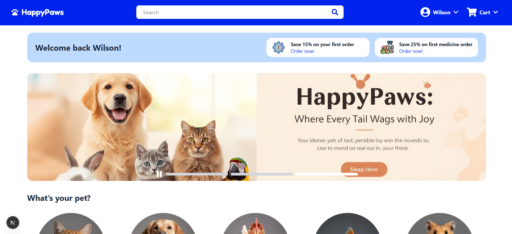
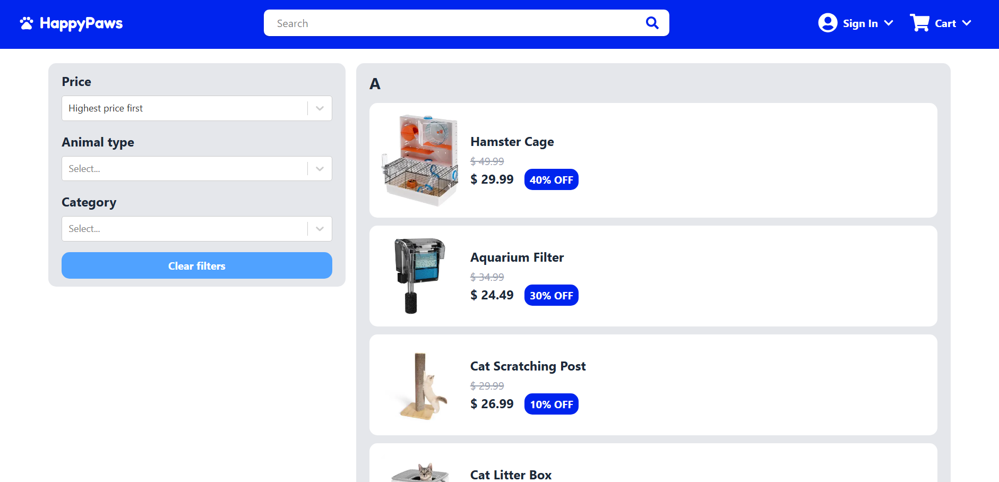
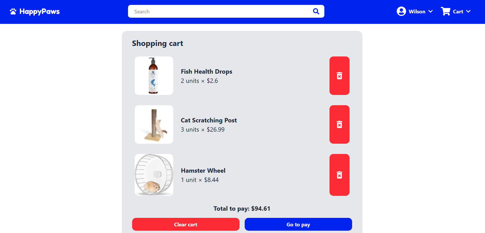
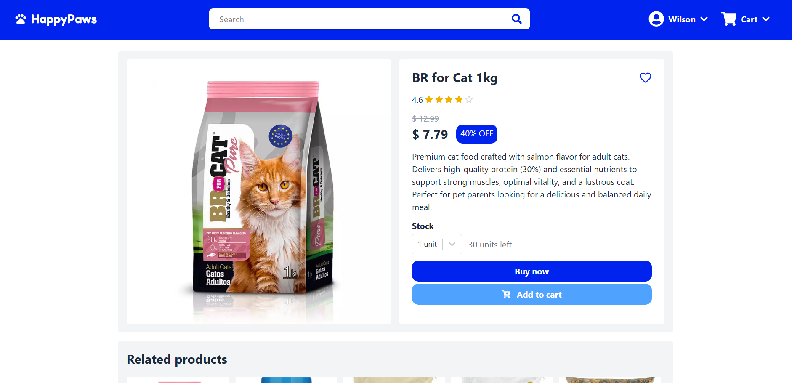

# Acerca de HappyPaws



## Descripción

Plataforma de comercio electrónico para mascotas. Incluye autenticación de usuarios, carrito de compras, búsqueda avanzada con filtrado y paginación, lista de deseos y un módulo de pagos con Stripe.

## Demo

[Ver demo en vivo](https://happy-paws-sr4m.vercel.app/)

## Características

- Autenticación segura de usuario usando firebase
  
- Búsqueda avanzada con filtrado y paginación de productos
  
- Carrito de compras funcional
  
- Modulo de pagos con Stripe
  
  
- Compra y detalle de productos
  
- Opciones de perfil
  

## Aprendizajes

- Implementación de Firebase con Google y Github
- Diseño de interfaces responsive con Tailwind CSS
- Manejo de pagos seguros mediante Stripe
- Almacenamiento de imágenes en Cloudinary
- Uso de Prisma para gestión eficiente de bases de datos
- Tipado y validación de datos con TypeScript
- Estructuración de un proyecto Next.js escalable

## Tecnologías

  
  


## Instalación Local

```bash
git clone https://github.com/WilloAndru/HappyPaws.git
cd HappyPaws
npm install
npm run dev
```
